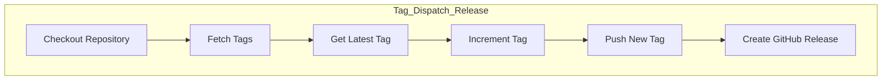
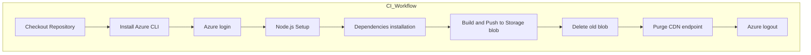

# GitHub Action for Tag Release, CI and CD
Contains GitHub-action workflows to manage Tag releases, Build and Push.

***
### *_Quick flow snippet_*:

#### Dispatch & Release, Build & Deploy

1. 🏷️ **Navigate to the "Actions" tab in your GitHub repository.**
2. 🖱️ **Select the "Tag Dispatch & Release" workflow.**
3. 📝 **Provide the required inputs (target branch and version type).**
4. ✅ **Click "Run workflow" to start the tag dispatch & release, build & push process.**

***

## Workflow description

### 1.Tag Dispatch & Release Workflow

This workflow is responsible for fetching the latest tag, incrementing the tag based on the selected branch env ( uat, prod) and version type (major, minor, patch), and then pushing the new tag to the repository. This workflow is manually triggered.

**File:** `.github/workflows/dispatch.yml`

**Trigger:** `Manual (workflow_dispatch)`

#### Inputs:

- **Branch:** The target branch to push the tag (`uat`, `prod`).
- **Version_type:** The type of version increment (`major`, `minor`, `patch`).

#### Steps:

### 2. Build & Push Workflow 
This workflow is triggered when a new release is published with the tag pattern `uat_v*`, `v*`. It performs the following tasks:

**File:** `.github/workflows/frontend-[Env].yaml`

**Trigger:** `Release published (release.published)`

#### Steps:

